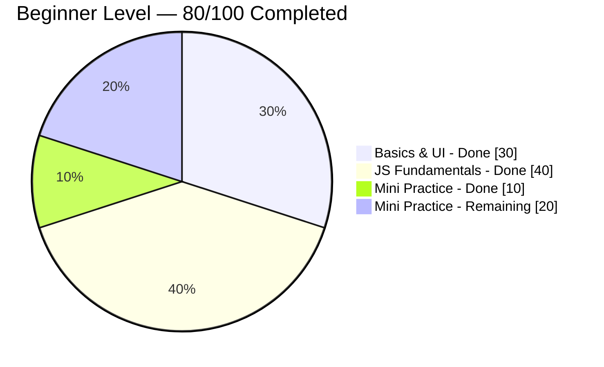

# 🟢 Beginner Level Projects


Part of the [Code-Odessey](https://github.com/Debanga-06/Code-Odessey) project series.

> ⬅️ [Back to main repo](../README.md) &nbsp;·&nbsp; Next level: [Intermediate →](../Intermediate-Level/README.md)

---

## 📖 Overview

This level is your foundation. Every project here is scoped to build **one core web-dev skill at a time** — no frameworks, no build tools, just HTML, CSS, and vanilla JavaScript. By the end of these 100 projects you should be comfortable with layouts, DOM manipulation, browser APIs, and shipping small, polished UIs from scratch.

**Goal:** Learn HTML, CSS, basic JavaScript, DOM, layouts, and responsiveness
**Tech Stack:** HTML5, CSS3, Vanilla JavaScript (ES6+)
**Prerequisites:** None — this is the starting point of Code-Odessey

## 📊 Progress

<!--
  HOW TO UPDATE: change the "Completed" / "Remaining" numbers for each section below.
  GitHub renders this Mermaid block as a live pie chart automatically.
-->


| Section | Range | Completed |
|---------|-------|-----------|
| Basics & UI Projects | 001–030 | 30/30 ✅ |
| JavaScript Fundamentals | 031–070 | 40/40 ✅ |
| Mini Practice Projects | 071–100 | 10/30 🚧 |

---

## Basics & UI Projects (1-30)

| ID | Project Name | Learning Outcome | Status |
|----|--------------|------------------|--------|
| 001 | [Personal Portfolio Website](https://project-01-sigma-eight.vercel.app/) | HTML structure, CSS styling, responsive design | [](https://github.com/Debanga-06/Code-Odessey/tree/main/Beginner-Level/Project-01) |
| 002 | [Resume Builder (Static)](https://resume-builder-ashy-seven.vercel.app/) | Forms, layout design, print CSS | [](https://github.com/Debanga-06/Code-Odessey/tree/main/Beginner-Level/Project-02) |
| 003 | [Landing Page](https://pr-2-liart.vercel.app/) | Hero sections, CTA buttons, modern design | [](https://github.com/Debanga-06/Code-Odessey/tree/main/Beginner-Level/Project-03) |
| 004 | [Restaurant Website](https://resturant-website-demo-tau.vercel.app/) | Multi-page layout, image optimization | [](https://github.com/Debanga-06/Code-Odessey/tree/main/Beginner-Level/Project-04) |
| 005 | [Coffee Shop Website](https://coffee-shop-kohl-phi.vercel.app/) | CSS Grid, menu layouts, typography | [](https://github.com/Debanga-06/Code-Odessey/tree/main/Beginner-Level/Project-05) |
| 006 | [Product Showcase Page](https://project-showcase-wheat-seven.vercel.app/) | Product cards, hover effects, transitions | [](https://github.com/Debanga-06/Code-Odessey/tree/main/Beginner-Level/Project-06) |
| 007 | [Blog Homepage](https://blog-homepage-ten.vercel.app/) | Article cards, sidebar layout, readability | [](https://github.com/Debanga-06/Code-Odessey/tree/main/Beginner-Level/Project-07) |
| 008 | [Pricing Table](https://pricing-table-two-omega.vercel.app/) | Table design, comparison layouts, buttons | [](https://github.com/Debanga-06/Code-Odessey/tree/main/Beginner-Level/Project-08) |
| 009 | [Image Gallery](https://image-gallery-pi-green.vercel.app/) | Grid layout, lightbox effect, thumbnails | [](https://github.com/Debanga-06/Code-Odessey/tree/main/Beginner-Level/Project-09) |
| 010 | [Login Page UI](https://login-page-ui-silk.vercel.app) | Form design, input styling, validation UI | [](https://github.com/Debanga-06/Code-Odessey/tree/main/Beginner-Level/Project-10) |
| 011 | [Signup Page UI](https://code-odessey.vercel.app) | Multi-field forms, password fields, UX | [](https://github.com/Debanga-06/Code-Odessey/tree/main/Beginner-Level/Project-11) |
| 012 | [Contact Form](https://code-odessey-e3q3.vercel.app) | Form elements, textarea, submit buttons | [](https://github.com/Debanga-06/Code-Odessey/tree/main/Beginner-Level/Project-12) |
| 013 | [About Us Page](https://code-odessey-h5az.vercel.app/) | Team sections, company info, storytelling | [](https://github.com/Debanga-06/Code-Odessey/tree/main/Beginner-Level/Project-13) |
| 014 | [FAQ Page](https://code-odessey-m8a5.vercel.app/) | Accordion-style layout, content structure | [](https://github.com/Debanga-06/Code-Odessey/tree/main/Beginner-Level/Project-14) |
| 015 | [Testimonials Section](https://testimonials-section-nu.vercel.app/) | Card layout, quotes, customer reviews | [](https://github.com/Debanga-06/Code-Odessey/tree/main/Beginner-Level/Project-15) |
| 016 | [Navbar Variations](https://navbar-variations.vercel.app/) | Navigation design, dropdown menus, mobile nav | [](https://github.com/Debanga-06/Code-Odessey/tree/main/Beginner-Level/Project-16) |
| 017 | [Footer Designs](https://footer-designs-theta.vercel.app/) | Footer layouts, links, social icons | [](https://github.com/Debanga-06/Code-Odessey/tree/main/Beginner-Level/Project-17) |
| 018 | [Card Layout Gallery](https://footer-designs-xdjf.vercel.app/) | Various card designs, shadows, borders | [](https://github.com/Debanga-06/Code-Odessey/tree/main/Beginner-Level/Project-18) |
| 019 | [Hero Section Designs](https://hero-section-designs-coral.vercel.app/) | Full-width headers, background images, CTAs | [](https://github.com/Debanga-06/Code-Odessey/tree/main/Beginner-Level/Project-19) |
| 020 | [Button Hover Effects](https://hero-section-designs-h2y3.vercel.app/) | CSS transitions, animations, interactions | [](https://github.com/Debanga-06/Code-Odessey/tree/main/Beginner-Level/Project-20) |
| 021 | [CSS Loader Collection](https://css-loader-collection.vercel.app) | Animations, keyframes, loading indicators | [](https://github.com/Debanga-06/Code-Odessey/tree/main/Beginner-Level/Project-21) |
| 022 | [Gradient Generator](https://gradient-generator-kappa-two.vercel.app/) | Color theory, CSS gradients, tools | [](https://github.com/Debanga-06/Code-Odessey/tree/main/Beginner-Level/Project-22) |
| 023 | [Color Palette Generator](https://color-seven-pied.vercel.app/) | Color schemes, design systems, palettes | [](https://github.com/Debanga-06/Code-Odessey/tree/main/Beginner-Level/Project-23) |
| 024 | [Typography Showcase](https://typography-kappa.vercel.app/) | Font pairing, text hierarchy, readability | [](https://github.com/Debanga-06/Code-Odessey/tree/main/Beginner-Level/Project-24) |
| 025 | [CSS Grid Playground](https://css-phi-snowy.vercel.app/) | Grid layout, template areas, alignment | [](https://github.com/Debanga-06/Code-Odessey/tree/main/Beginner-Level/Project-25) |
| 026 | [Flexbox Layout Builder](https://css-vju3.vercel.app/) | Flexbox properties, alignment, distribution | [](https://github.com/Debanga-06/Code-Odessey/tree/main/Beginner-Level/Project-26) |
| 027 | [Mobile Responsive Page](https://code-odessey-2mnf.vercel.app/) | Media queries, responsive design, breakpoints | [](https://github.com/Debanga-06/Code-Odessey/tree/main/Beginner-Level/Project-27) |
| 028 | [Dark Mode Toggle](https://dark-iota-ten.vercel.app/) | Theme switching, CSS variables, localStorage | [](https://github.com/Debanga-06/Code-Odessey/tree/main/Beginner-Level/Project-28) |
| 029 | [404 Error Page](https://404-mu-six.vercel.app/) | Error handling UI, creative design, redirects | [](https://github.com/Debanga-06/Code-Odessey/tree/main/Beginner-Level/Project-29) |
| 030 | [Coming Soon Page](https://coming-opal.vercel.app/) | Launch pages, countdown timers, email capture | [](https://github.com/Debanga-06/Code-Odessey/tree/main/Beginner-Level/Project-30) |

---

## JavaScript Fundamentals (31-70)

| ID | Project Name | Learning Outcome | Status |
|----|--------------|------------------|--------|
| 031 | [Counter App](https://counter-app-beta-ten-89.vercel.app/) | DOM manipulation, event listeners, state | [](https://github.com/Debanga-06/Code-Odessey/tree/main/Beginner-Level/Project-31) |
| 032 | [Digital Clock](https://counter-app-m84h.vercel.app/) | Date object, setInterval, time formatting | [](https://github.com/Debanga-06/Code-Odessey/tree/main/Beginner-Level/Project-32) |
| 033 | [Stopwatch](https://stopwatch-three-rho.vercel.app/) | Timing functions, start/stop logic, display | [](https://github.com/Debanga-06/Code-Odessey/tree/main/Beginner-Level/Project-33) |
| 034 | [Countdown Timer](https://countdown-timer-seven-roan.vercel.app/) | Time calculations, countdown logic, alerts | [](https://github.com/Debanga-06/Code-Odessey/tree/main/Beginner-Level/Project-34) |
| 035 | [Random Quote Generator](https://random-quote-generator-psi-sand.vercel.app/) | Arrays, random selection, DOM updates | [](https://github.com/Debanga-06/Code-Odessey/tree/main/Beginner-Level/Project-35) |
| 036 | [Number Guessing Game](https://number-guessing-game-bice-one.vercel.app/) | Game logic, conditionals, user input | [](https://github.com/Debanga-06/Code-Odessey/tree/main/Beginner-Level/Project-36) |
| 037 | [Dice Roller](https://dice-roller-six-zeta.vercel.app/) | Random numbers, animations, game mechanics | [](https://github.com/Debanga-06/Code-Odessey/tree/main/Beginner-Level/Project-37) |
| 038 | [Password Strength Checker](https://password-strength-checker-pi-gules.vercel.app/) | String validation, regex, security concepts | [](https://github.com/Debanga-06/Code-Odessey/tree/main/Beginner-Level/Project-38) |
| 039 | [Tip Calculator](https://bmi-calculator-six-peach.vercel.app/) | Math operations, input handling, calculations | [](https://github.com/Debanga-06/Code-Odessey/tree/main/Beginner-Level/Project-39) |
| 040 | [BMI Calculator](https://temperature-converter-kohl-five.vercel.app/) | Formula implementation, input validation, results | [](https://github.com/Debanga-06/Code-Odessey/tree/main/Beginner-Level/Project-40) |
| 041 | [Temperature Converter](https://unit-converter-y1xm.vercel.app/) | Unit conversion, formulas, user interface | [](https://github.com/Debanga-06/Code-Odessey/tree/main/Beginner-Level/Project-41) |
| 042 | [Unit Converter](https://unit-converter-five-lilac.vercel.app/) | Multiple conversions, dropdown menus, logic | [](https://github.com/Debanga-06/Code-Odessey/tree/main/Beginner-Level/Project-42) |
| 043 | [Random Color Generator](https://background-color-changer-6wfj.vercel.app/) | RGB/HEX colors, randomization, display | [](https://github.com/Debanga-06/Code-Odessey/tree/main/Beginner-Level/Project-43) |
| 044 | [Background Color Changer](https://background-color-changer-phi-one.vercel.app/) | Event handling, style manipulation, colors | [](https://github.com/Debanga-06/Code-Odessey/tree/main/Beginner-Level/Project-44) |
| 045 | [Simple Calculator](https://form-validation-app-j7kz.vercel.app/) | Arithmetic operations, calculator logic, UI | [](https://github.com/Debanga-06/Code-Odessey/tree/main/Beginner-Level/Project-45) |
| 046 | [Form Validation App](https://form-validation-app-gold.vercel.app/) | Input validation, error messages, UX | [](https://github.com/yourusername/Project-46) |
| 047 | [To-Do List (Basic)](https://to-do-list-basic-two.vercel.app/) | CRUD operations, array methods, local state | [](https://github.com/Debanga-06/Code-Odessey/tree/main/Beginner-Level/Project-47) |
| 048 | [Notes App (LocalStorage)](https://notes-app-lake-five.vercel.app/) | LocalStorage API, data persistence, CRUD | [](https://github.com/Debanga-06/Code-Odessey/tree/main/Beginner-Level/Project-48) |
| 049 | [Accordion Component](https://according-component.vercel.app/) | Toggle functionality, dynamic content, UI | [](https://github.com/Debanga-06/Code-Odessey/tree/main/Beginner-Level/Project-49) |
| 050 | [Tabs Component](https://tabcomponent.vercel.app/) | Tab switching, content display, navigation | [](https://github.com/Debanga-06/Code-Odessey/tree/main/Beginner-Level/Project-50) |
| 051 | [Modal Popup](https://modal-popup-five.vercel.app/) | Overlay, show/hide logic, event handling | [](https://github.com/Debanga-06/Code-Odessey/tree/main/Beginner-Level/Project-51) |
| 052 | [Image Slider](https://image-slider-kappa-bice.vercel.app/) | Image rotation, navigation, autoplay | [](https://github.com/Debanga-06/Code-Odessey/tree/main/Beginner-Level/Project-52) |
| 053 | [Simple Carousel](https://simple-carousel.vercel.app/) | Carousel logic, animations, controls | [](https://github.com/Debanga-06/Code-Odessey/tree/main/Beginner-Level/Project-53) |
| 054 | [FAQ Toggle](https://faq-toggle.vercel.app/) | Expand/collapse, dynamic content, icons | [](https://github.com/Debanga-06/Code-Odessey/tree/main/Beginner-Level/Project-54) |
| 055 | [Star Rating Widget](https://star-rating-widget.vercel.app/) | Click handling, visual feedback, ratings | [](https://github.com/Debanga-06/Code-Odessey/tree/main/Beginner-Level/Project-55) |
| 056 | [Word Counter](https://word-counter-one-orcin.vercel.app/) | String manipulation, real-time updates, stats | [](https://github.com/Debanga-06/Code-Odessey/tree/main/Beginner-Level/Project-56) |
| 057 | [Character Counter](https://charecter-counter-olive.vercel.app/) | Text analysis, input events, display | [](https://github.com/Debanga-06/Code-Odessey/tree/main/Beginner-Level/Project-57) |
| 058 | [Email Validator](https://email-validator-chi-silk.vercel.app/) | Regex patterns, validation logic, feedback | [](https://github.com/Debanga-06/Code-Odessey/tree/main/Beginner-Level/Project-58) |
| 059 | [Password Generator](https://password-generator-three-gilt-79.vercel.app/) | Random generation, string building, security | [](https://github.com/Debanga-06/Code-Odessey/tree/main/Beginner-Level/Project-59) |
| 060 | [Random Username Generator](https://username-generator-tau.vercel.app/) | String concatenation, random words, creativity | [](https://github.com/Debanga-06/Code-Odessey/tree/main/Beginner-Level/Project-60) |
| 061 | [Simple Quiz App](https://quiz-app-omega-rosy-81.vercel.app/) | Quiz logic, score tracking, questions array | [](https://github.com/Debanga-06/Code-Odessey/tree/main/Beginner-Level/Project-61) |
| 062 | [Yes/No Game](https://yes-no-game-alpha.vercel.app/) | Decision tree, game flow, user interaction | [](https://github.com/Debanga-06/Code-Odessey/tree/main/Beginner-Level/Project-62) |
| 063 | [Rock Paper Scissors](https://rock-paper-sessior-game-three.vercel.app/) | Game logic, computer AI, win conditions | [](https://github.com/Debanga-06/Code-Odessey/tree/main/Beginner-Level/Project-63) |
| 064 | [Memory Flip Game (Basic)](https://memory-game-silk-eta.vercel.app/) | Game state, matching logic, grid layout | [](https://github.com/Debanga-06/Code-Odessey/tree/main/Beginner-Level/Project-64) |
| 065 | [Keyboard Event Tester](https://keyboard-checker-lovat.vercel.app/) | Event listeners, key detection, display | [](https://github.com/Debanga-06/Code-Odessey/tree/main/Beginner-Level/Project-65) |
| 066 | [Mouse Tracker](https://mouse-tracker-six.vercel.app/) | Mouse events, coordinates, real-time tracking | [](https://github.com/Debanga-06/Code-Odessey/tree/main/Beginner-Level/Project-66) |
| 067 | [Scroll Progress Bar](https://scroll-progress-bar-seven.vercel.app/) | Scroll events, progress calculation, indicator | [](https://github.com/Debanga-06/Code-Odessey/tree/main/Beginner-Level/Project-67) |
| 068 | [Theme Switcher](https://theme-switcher-inky.vercel.app/) | Multiple themes, CSS variables, persistence | [](https://github.com/Debanga-06/Code-Odessey/tree/main/Beginner-Level/Project-68) |
| 069 | [Alert Notification UI](https://alert-notification.vercel.app/) | Notifications, dismiss functionality, timing | [](https://github.com/Debanga-06/Code-Odessey/tree/main/Beginner-Level/Project-69) |
| 070 | [Simple Chat UI (Static)](https://simple-chat-bay-theta.vercel.app/) | Chat layout, message bubbles, conversation flow | [](https://github.com/Debanga-06/Code-Odessey/tree/main/Beginner-Level/Project-70) |

---

## Mini Practice Projects (71-100)

| ID | Project Name | Learning Outcome | Status |
|----|--------------|------------------|--------|
| 071 | Weather UI (Static) | Weather layouts, icons, data display | [](https://github.com/Debanga-06/Code-Odessey/tree/main/Beginner-Level/project-71) |
| 072 | Music Player UI | Player controls, progress bars, playlists | [](https://github.com/Debanga-06/Code-Odessey/tree/main/Beginner-Level/project-72) |
| 073 | Video Player UI | Video controls, custom players, fullscreen | [](https://github.com/Debanga-06/Code-Odessey/tree/main/Beginner-Level/project-73) |
| 074 | Poll Voting UI | Voting interface, results display, percentages | [](https://github.com/Debanga-06/Code-Odessey/tree/main/Beginner-Level/project-74) |
| 075 | Feedback Form | Form design, ratings, text feedback | [](https://github.com/Debanga-06/Code-Odessey/tree/main/Beginner-Level/project-75) |
| 076 | Survey Page | Multiple questions, radio buttons, checkboxes | [](https://github.com/Debanga-06/Code-Odessey/tree/main/Beginner-Level/project-76) |
| 077 | Online Menu Page | Menu sections, item cards, prices | [](https://github.com/Debanga-06/Code-Odessey/tree/main/Beginner-Level/project-77) |
| 078 | Event Invitation Page | Event details, RSVP form, date/time | [](https://github.com/Debanga-06/Code-Odessey/tree/main/Beginner-Level/project-78) |
| 079 | Profile Card Generator | User profiles, avatar, social links | [](https://github.com/Debanga-06/Code-Odessey/tree/main/Beginner-Level/project-79) |
| 080 | Badge Generator | Dynamic badges, SVG, customization | [](https://github.com/Debanga-06/Code-Odessey/tree/main/Beginner-Level/project-80) |
| 081 | CSS Animation Showcase | Various animations, keyframes, effects | [](https://github.com/Debanga-06/Code-Odessey/tree/main/Beginner-Level/project-81) |
| 082 | Login Validation Demo | Real-time validation, error handling, UX | [](https://github.com/Debanga-06/Code-Odessey/tree/main/Beginner-Level/project-82) |
| 083 | Simple E-commerce UI | Product pages, cart icon, checkout flow | [](https://github.com/Debanga-06/Code-Odessey/tree/main/Beginner-Level/project-83) |
| 084 | Pricing Calculator | Dynamic pricing, options, total calculation | [](https://github.com/Debanga-06/Code-Odessey/tree/main/Beginner-Level/project-84) |
| 085 | Random Joke Generator | API calls or local data, humor display | [](https://github.com/Debanga-06/Code-Odessey/tree/main/Beginner-Level/project-85) |
| 086 | Virtual Keyboard | On-screen keyboard, click handling, input | [](https://github.com/Debanga-06/Code-Odessey/tree/main/Beginner-Level/project-86) |
| 087 | Sticky Notes Board | Draggable notes, create/delete, positioning | [](https://github.com/Debanga-06/Code-Odessey/tree/main/Beginner-Level/project-87) |
| 088 | Scroll Reveal Animations | Intersection Observer, reveal effects, scroll | [](https://github.com/Debanga-06/Code-Odessey/tree/main/Beginner-Level/project-88) |
| 089 | CSS Art Project | Pure CSS art, creativity, advanced styling | [](https://github.com/Debanga-06/Code-Odessey/tree/main/Beginner-Level/project-89) |
| 090 | Social Media Post UI | Post cards, likes, comments, shares | [](https://github.com/Debanga-06/Code-Odessey/tree/main/Beginner-Level/project-90) |
| 091 | [Notification Bell UI](https://notification-ui-seven.vercel.app/) | Notification icon, dropdown, unread count | [](https://github.com/Debanga-06/Code-Odessey/tree/main/Beginner-Level/project-91) |
| 092 | [Search Bar UI](https://search-bar-ui-phi.vercel.app/) | Search input, suggestions, autocomplete | [](https://github.com/Debanga-06/Code-Odessey/tree/main/Beginner-Level/project-92) |
| 093 | [Filter List App](https://filter-list.vercel.app/) | Filtering logic, categories, search | [](https://github.com/Debanga-06/Code-Odessey/tree/main/Beginner-Level/project-93) |
| 094 | [Sortable List](https://sortable-list-sepia.vercel.app/) | Sorting algorithms, array methods, display | [](https://github.com/Debanga-06/Code-Odessey/tree/main/Beginner-Level/project-94) |
| 095 | [Drag & Drop Demo](https://drag-drop-pi-ten.vercel.app/) | Drag API, drop zones, event handling | [](https://github.com/Debanga-06/Code-Odessey/tree/main/Beginner-Level/Project-95) |
| 096 | [Simple Dashboard UI](https://dashboard-ui-five-kappa.vercel.app/) | Dashboard layout, widgets, data cards | [](https://github.com/Debanga-06/Code-Odessey/tree/main/Beginner-Level/Project-96) |
| 097 | [Portfolio v2](https://portfolio-v2-gules-nu.vercel.app/) | Enhanced portfolio, animations, projects | [](https://github.com/Debanga-06/Code-Odessey/tree/main/Beginner-Level/Project-97) |
| 098 | [Blog Page v2](https://blog-page-v2.vercel.app/) | Improved blog, categories, tags | [](https://github.com/Debanga-06/Code-Odessey/tree/main/Beginner-Level/Project-98) |
| 099 | [Website Clone (Static)](https://website-clone-static.vercel.app/) | Replicate existing site, learning from real sites | [](https://github.com/Debanga-06/Code-Odessey/tree/main/Beginner-Level/Project-99) |
| 100 | [Mini Project Collection Page](https://miniprojectcollectionpage.vercel.app/) | Showcase all projects, gallery, navigation | [](https://github.com/Debanga-06/Code-Odessey/tree/main/Beginner-Level/Project-100) |

---

## 🛠️ Technologies Covered in This Level


`HTML5 semantic markup & accessibility` · `CSS3 — Flexbox, Grid, animations, custom properties` · `Vanilla JavaScript — DOM, events, closures` · `Browser APIs — LocalStorage, Intersection Observer, Drag & Drop` · `Responsive & mobile-first design`

## 🚀 How to Run a Project Locally

1. Navigate into the project folder, e.g.:
   ```bash
   cd Beginner-Level/Project-01
   ```
2. Open `index.html` directly in your browser, **or** serve it locally:
   ```bash
   npx serve .
   ```
3. No build step or dependencies required unless the project's own README says otherwise.

## 🤝 Contributing to This Level

Picking up one of the ❌ **Not Started** projects above is one of the easiest ways to make your first contribution to Code-Odessey. Fork the repo, build the project inside `Beginner-Level/project-XXX`, add a short README with a live demo link, and open a PR. See the [main contributing guide](../README.md#-contributing) for the full workflow.

## 📞 Questions?

Open an [issue](https://github.com/Debanga-06/Code-Odessey/issues) or join the [Discord](https://discord.gg/6JFBppePjx) — the community is happy to help.

---

> ⬅️ [Back to main repo](../README.md) &nbsp;·&nbsp; Next level: [Intermediate →](../Intermediate-Level/README.md)

*Made with ❤️ by the Code-Odessey community*