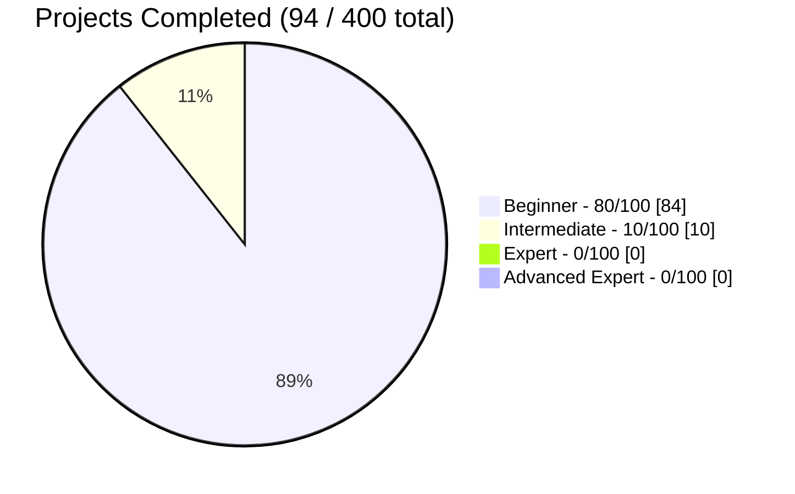

# Code-Odessey 🚀

[](https://github.com/Debanga-06/Code-Odessey/graphs/contributors)
[](https://github.com/Debanga-06/Code-Odessey/issues)
[](https://github.com/Debanga-06/Code-Odessey/pulls)


## Overview

Welcome to **Code-Odessey** – a comprehensive collection of 400+ mini web development projects designed to take you on a journey from beginner to expert level. This repository serves as a practical learning resource and showcase of web development skills, featuring projects that span across various technologies, frameworks, and complexity levels.

Whether you're just starting your coding journey or looking to sharpen your skills with advanced challenges, Code-Odessey offers hands-on projects that cover:

- **Frontend Development**: HTML, CSS, JavaScript, React, Vue, Angular
- **Backend Development**: Node.js, Express, APIs, Databases
- **Full-Stack Applications**: Complete web applications with frontend and backend integration
- **Modern Tools & Frameworks**: Latest web development technologies and best practices

Each project comes with clear documentation, source code, and learning objectives to help developers understand and implement real-world solutions.

## 🤝 Contributing

We welcome contributions from developers of all skill levels! When you contribute a project that gets merged into the main repository, your project details will be automatically added to the relevant level's project list, giving you recognition for your valuable contribution.

### How to Contribute

1. **Fork** this repository
2. **Create** a new branch for your feature (`git checkout -b feature/amazing-project`)
3. **Add** your project to the appropriate difficulty folder
4. **Include** proper documentation and README for your project
5. **Commit** your changes (`git commit -m 'Add amazing project'`)
6. **Push** to the branch (`git push origin feature/amazing-project`)
7. **Open** a Pull Request

For detailed contribution guidelines, please read our [CONTRIBUTING.md](CONTRIBUTING.md) file.

---

## 🗺️ Explore by Level

| Level | Focus | Progress | Browse |
|-------|-------|----------|--------|
| 🟢 **Beginner** (1-100) | HTML, CSS, DOM, Vanilla JS, responsive layouts |  | [**View Projects →**](Beginner-Level/README.md) |
| 🟡 **Intermediate** (101-200) | REST APIs, React/Vue, state management, real apps |  | [**View Projects →**](Intermediate-Level/README.md) |
| 🔵 **Expert** (201-300) | Full-stack apps, auth, databases, advanced architecture |  | Coming Soon |
| 🔴 **Advanced Expert** (301-400) | Production-grade systems, scaling, real-world engineering |  | Coming Soon |

Each level has its own README with the full project table, live demo links, and source code — click through to explore.

---

## ✨ Featured Projects

A handful of standouts worth checking out first:

| Project | Level | What it does |
|---------|-------|---------------|
| [🌤️ Weather App (API)](https://code-odessey-8ch6.vercel.app/) | Intermediate | Live weather data via Fetch API + async/await |
| [🐙 GitHub Profile Finder](https://github-finder-five-rho.vercel.app/) | Intermediate | Search any GitHub user and browse their repos |
| [🎬 Movie Search App](https://movie-search-app-roan-seven.vercel.app/) | Intermediate | Search movies with posters, ratings & details |
| [📊 Simple Dashboard UI](https://dashboard-ui-five-kappa.vercel.app/) | Beginner | Clean widget-based dashboard layout |
| [🎨 Portfolio v2](https://portfolio-v2-gules-nu.vercel.app/) | Beginner | Animated, modern developer portfolio |
| [🌍 Country Info App](https://country-finder-ecru.vercel.app) | Intermediate | Explore countries with flags & population data |

👉 See every project in [Beginner-Level](Beginner-Level/README.md) and [Intermediate-Level](Intermediate-Level/README.md).

---

## 📊 Progress Tracking

<!--
  HOW TO UPDATE: just change the numbers below (one per level).
  GitHub renders this Mermaid block as a live pie chart automatically — no image, no tool needed.
-->


| Level | Completed |
|-------|-----------|
| 🟢 Beginner | 84/100 |
| 🟡 Intermediate | 10/100 |
| 🔵 Expert | 0/100 |
| 🔴 Advanced Expert | 0/100 |

## 🛠️ Technologies You'll Master

**Beginner Level**


`HTML5` · `CSS3 (Flexbox/Grid)` · `Vanilla JavaScript` · `DOM Manipulation` · `LocalStorage` · `Responsive / Mobile-First Design`

**Intermediate Level**


`REST APIs` · `Fetch / Async-Await` · `React.js` · `Vue.js` · `Angular` · `State Management & Routing` · `Tailwind CSS` · `Bootstrap` · `Third-party API Integration`

---

## 👥 Contributors

This project exists thanks to all the amazing people who contribute! 🎉

### 🏆 Core Team

<table>
  <tr>
    <td align="center">
      <a href="https://github.com/Debanga-06">
        
        <br />
        <sub><b>Debanga</b></sub>
      </a>
      <br />
      <span title="Project Creator">🌟 Creator</span>
      <br />
      <br />
      <span title="Code">💻 100+ Projects</span>
      <br />
      <span title="Documentation">📖 Docs</span>
      <span title="Maintenance">🔧 Maintainer</span>
    </td>
    <td align="center">
      <a href="https://github.com/Jiban0507">
        
        <br />
        <sub><b>Jiban</b></sub>
      </a>
      <br />
      <span title="Controller">🕹️ Repo Controller </span>
      <br />
      <span title="Code">💻 50+ Projects</span>
  </tr>
</table>

### 🌟 Top Contributors

<!-- This section will be automatically updated -->
<a href="https://github.com/Debanga-06/Code-Odessey/graphs/contributors">
  
</a>

### 💝 Special Thanks

Special recognition to contributors who have made significant non-code contributions:

- 🐛 **Bug Hunters** - Helping identify and report issues
- 📝 **Documentation Heroes** - Improving project documentation
- 💡 **Idea Contributors** - Suggesting new projects and features
- 🎨 **Design Contributors** - Enhancing UI/UX and visual elements
- 🌍 **Community Builders** - Helping others learn and grow

### 🎯 Contribution Milestones

- ✅ **Project Launch** - August 2025
- ✅ **First 10 Projects** - January 2026
- ✅ **First 25 Projects** - February 2026
- ✅ **50 Projects** - Target: April 2026
- 🎯 **100 Projects** - Target: June 2027

---

## 🚀 Getting Started

1. **Clone** the repository:
   ```bash
   git clone https://github.com/Debanga-06/Code-Odessey.git
   cd Code-Odessey
   ```

2. **Explore** projects by difficulty level
3. **Choose** a project that matches your skill level
4. **Follow** the individual project README for setup instructions

## 🛠️ Technologies

This repository showcases projects built with various technologies including:

- **Frontend**: HTML5, CSS3, JavaScript (ES6+), TypeScript
- **CSS Frameworks**: Bootstrap, Tailwind CSS, Bulma
- **JavaScript Frameworks**: React, Vue.js, Angular, Svelte
- **Backend**: Node.js, Express.js, Python (Flask/Django), PHP
- **Databases**: MongoDB, MySQL, PostgreSQL, Firebase
- **Tools**: Webpack, Vite, Gulp, Sass/SCSS
- **APIs**: REST APIs, GraphQL, Third-party integrations

## 📈 Project Statistics

- **Total Projects**: 400+
- **Beginner Projects**: Ongoing
- **Intermediate Projects**: Ongoing
- **Expert Projects**: Coming soon
- **Contributors**: [See all contributors](https://github.com/Debanga-06/Code-Odessey/graphs/contributors)

## 🏆 Recognition

Contributors whose projects are merged will be:
- Listed in the relevant level's project list with proper attribution
- Added to our Contributors section
- Recognized in our Hall of Fame (coming soon)

## 📄 License

This project is licensed under the AGPL- 3.0 License - see the [LICENSE](LICENSE) file for details.

## 📞 Contact & Support

- **Issues**: [Create an issue](https://github.com/Debanga-06/Code-Odessey/issues)
- **Discussions**: [Join our discussions](https://github.com/Debanga-06/Code-Odessey/discussions)
- **Email**: debanga078@gmail.com
- **Discord**: [Join our community](https://discord.gg/6JFBppePjx)

## 🌟 Show Your Support

If you find this repository helpful, please consider:
- ⭐ Starring the repository
- 🔄 Sharing it with others
- 🤝 Contributing your own projects
- 📢 Spreading the word

---

**Happy Coding!** 🎉

*Made with ❤️ by the Code-Odessey community*